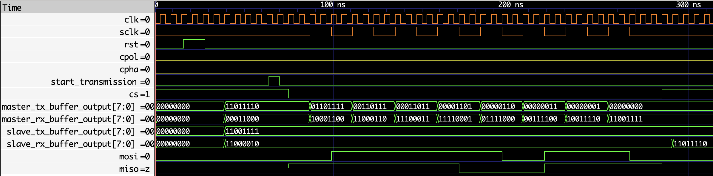
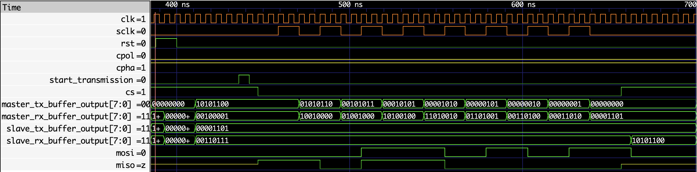
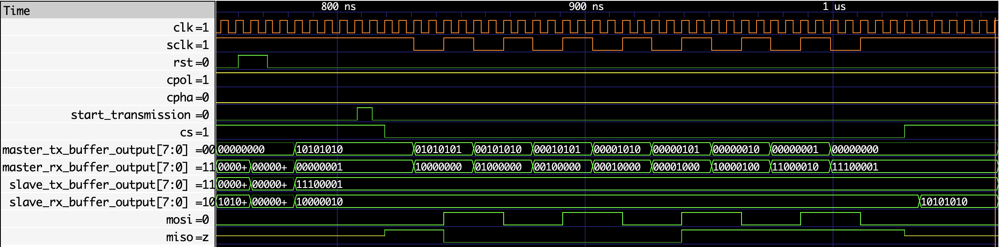
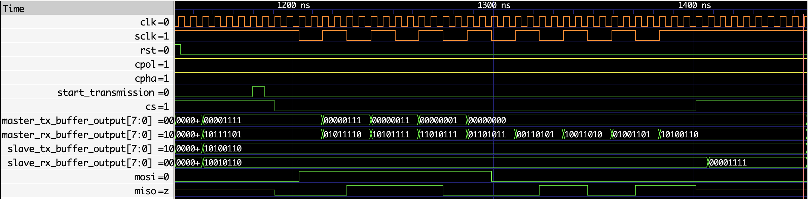

[](https://opensource.org/licenses/MIT)&emsp;[](https://github.com/RoiCorporation/spi-vhdl/actions/workflows/tests.yaml)


# SPI implementation in VHDL
Implementation of the Serial Peripheral Interface (SPI) communication protocol using VHDL.


## 🚀 Running a simulation and visualizing the waveform
[NVC](https://github.com/nickg/nvc) can be used to run a simulation and generate
the corresponding waveform, like this.
```
nvc -a src/master/spi_master.vhd src/slave/spi_slave.vhd testbenches/main_tb.vhd -e main_tb -r main_tb --wave=waves.vcd
```

To visualize the waveform file of the simulation run, open the file with your
preferred waveform viewer. With [GTKWave](https://github.com/gtkwave/gtkwave),
it's as easy as this:
```
gtkwave waves.vcd
```


## 📈 Results
Here are some screenshots of the waveform file generated when running the simulation
testbench. They depict the behavior of both the master and the slave at every SPI
mode (0 through 3), and they are useful evidence of the compliance of this
implementation with existing SPI literature.

<table>
  <tr>
    <td>
        <div style="text-align: center">
            <p>Mode 0 (CPOL = 0, CPHA = 0)</p>
        </div>
    </td>
    <td>
        <div style="text-align: center">
            <p>Mode 1 (CPOL = 0, CPHA = 1)</p>
        </div>
    </td>
  </tr>
  <tr>
    <td>
        <div style="text-align: center">
            <p>Mode 2 (CPOL = 1, CPHA = 0)</p>
        </div>
    </td>
    <td>
        <div style="text-align: center">
            <p>Mode 3 (CPOL = 1, CPHA = 1)</p>
        </div>
    </td>
  </tr>
</table>
