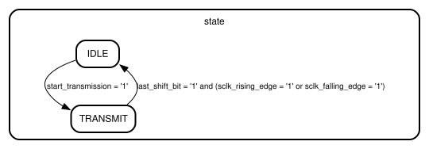

# Entity: spi_master
- **File**: spi_master.vhd
- **Title:**  SPI master implementation in VHDL
- **File:**  spi_master.vhd
- **Author:**  Roi (r.lopezbarata@gmail.com)
- **Version:**  1.0
- **Date:**  21-07-2026
- **Copyright:**  This work is licensed under the MIT License.
- **Brief:**  Implementation of an SPI master module in VHDL.

## Diagram

## Description

This is an implementation of an SPI master module. It handles the transmission
and reception of data through the SPI interface, managing the clock signal,
chip select, and data lines (MOSI and MISO). The module supports different SPI
modes based on the clock polarity (CPOL) and clock phase (CPHA) settings. It
also provides the ability to load data into tx and rx buffers, allowing for
flexible data handling during SPI communication.

## Generics

| Generic name       | Type    | Value | Description                                                                         |
| ------------------ | ------- | ----- | ----------------------------------------------------------------------------------- |
| bits_per_message   | integer | 8     | Bits exchanged in each SPI transmission.                                            |
| sclk_divider_value | integer | 4     | Clock divider value to generate the SPI clock (sclk) from the module's clock (clk). |

## Ports

| Port name          | Direction | Type                                            | Description                                                                       |
| ------------------ | --------- | ----------------------------------------------- | --------------------------------------------------------------------------------- |
| rst                | in        | std_logic                                       | Synchronous reset to initialize the SPI master module.                            |
| clk                | in        | std_logic                                       | Internal clock signal for the SPI master module.                                  |
| sclk               | out       | std_logic                                       | SPI clock output signal, generated based on the clk input and sclk_divider_value. |
| cpol               | in        | std_logic                                       | Clock polarity setting for the SPI communication (0 or 1).                        |
| cpha               | in        | std_logic                                       | Clock phase setting for the SPI communication (0 or 1).                           |
| start_transmission | in        | std_logic                                       | Signal to initiate an SPI transmission.                                           |
| cs                 | out       | std_logic                                       | Chip select signal.                                                               |
| mosi               | out       | std_logic                                       | Master Out Slave In signal.                                                       |
| miso               | in        | std_logic                                       | Master In Slave Out signal.                                                       |
| tx_buffer_input    | in        | std_logic_vector(bits_per_message - 1 downto 0) | Transmission buffer input.                                                        |
| tx_buffer_output   | out       | std_logic_vector(bits_per_message - 1 downto 0) | Transmission buffer output.                                                       |
| tx_buffer_load     | in        | std_logic                                       | Signal to load data into the transmission buffer.                                 |
| rx_buffer_input    | in        | std_logic_vector(bits_per_message - 1 downto 0) | Reception buffer input.                                                           |
| rx_buffer_output   | out       | std_logic_vector(bits_per_message - 1 downto 0) | Reception buffer output.                                                          |
| rx_buffer_load     | in        | std_logic                                       | Signal to load data into the reception buffer.                                    |

## Signals

| Name                  | Type                                            | Description                                                                      |
| --------------------- | ----------------------------------------------- | -------------------------------------------------------------------------------- |
| state                 | state_t                                         | Current state of the SPI master state machine.                                   |
| last_shift_bit        | std_logic                                       | Flag to indicate if the last bit of the current transmission has been processed. |
| sclk_rising_edge      | std_logic                                       | Rising edge of SPI clock (sclk).                                                 |
| sclk_falling_edge     | std_logic                                       | Falling edge of SPI clock (sclk).                                                |
| tx_buffer_output_data | std_logic_vector(bits_per_message - 1 downto 0) | Data output from the transmission buffer.                                        |
| rx_buffer_output_data | std_logic_vector(bits_per_message - 1 downto 0) | Data output from the reception buffer.                                           |

## Enums

### *state_t*
| Name                | Description                                                      |
| ------------------- | ---------------------------------------------------------------- |
| IDLE                | Idle state (no active transmission -> CS = 1).                   |
| TRANSMIT            | Transmission state (active transmission -> CS = 0).              |
| FINISH_TRANSMISSION | Finish transmission state (finished the transmission -> CS = 1). |

## Processes
- fsm_proc: ( clk )
  - **Description**
  Implements the SPI master state machine, generating SCLK, controlling CS, and shifting data between the tx/rx buffers and the SPI data lines according to the selected CPOL/CPHA mode.

## State machines

- Implements the SPI master state machine, generating SCLK, controlling CS, and shifting data between the tx/rx buffers and the SPI data lines according to the selected CPOL/CPHA mode.

